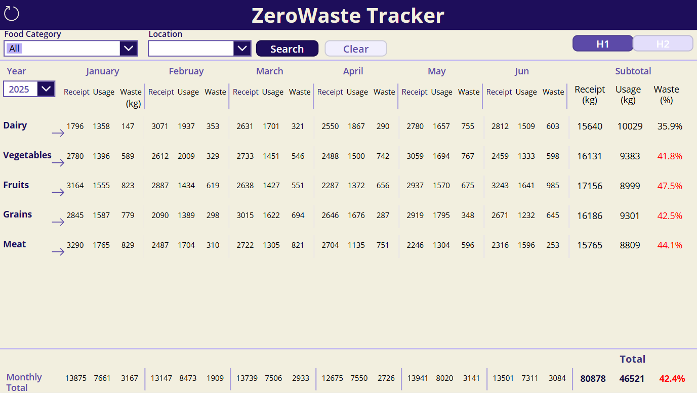
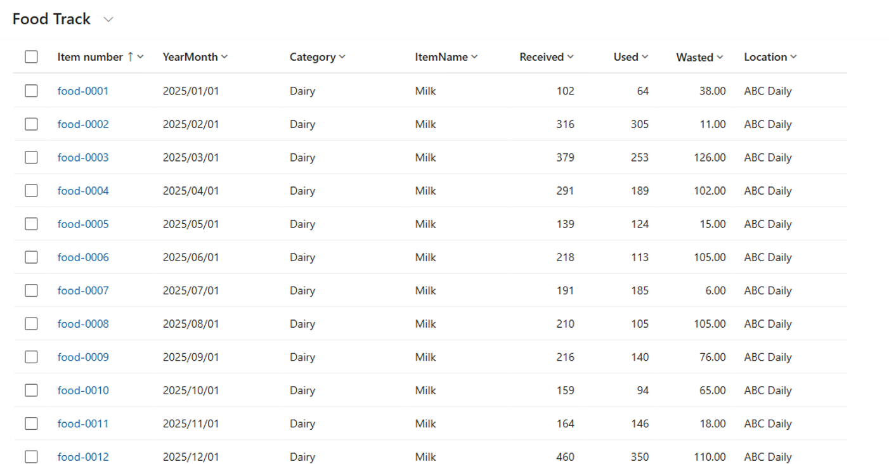
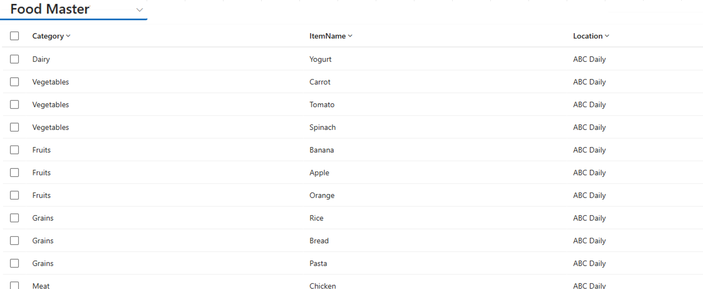
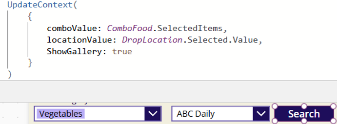
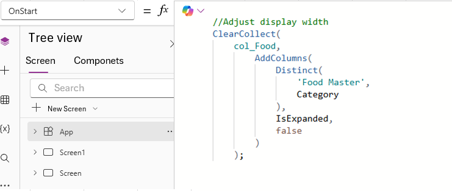
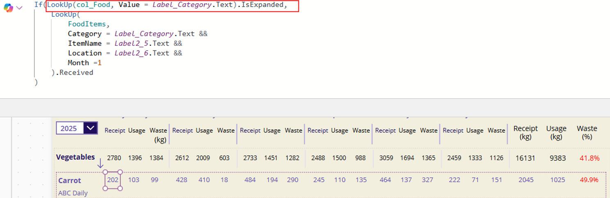

# ZeroWaste Tracker – Inventory Visibility & Waste Reduction App

## Overview
Zero Waste Tracker is a **Power Apps Canvas application** designed to visualize inventory, usage, and food waste across multiple locations.  
It helps identify overstock, prevent unnecessary ordering, and support surplus reallocation between stores.

This app was built to demonstrate **real-world data modeling, performance optimization, and large dataset handling** within Power Platform.

---

## Background & Problem
In many retail and food-related businesses, inventory is managed independently at each location.  
This often leads to situations where:

- One store is overstocked while another is short on the same item  
- Items are reordered even though surplus exists elsewhere  
- Waste rates gradually increase without being noticed  

In sample scenarios, inconsistent ordering patterns resulted in simulated waste rates of **40–50%**.

A simple but structured tool was needed to:

- Visualize inventory and waste by category and location  
- Identify problem areas quickly  
- Support decision-making for surplus sharing  

---

## Solution
Zero Waste Tracker provides:

- **Store-level visibility** of receipts, usage, and waste by month × category  
- **Half-year aggregation (H1 / H2)** with auto-calculated totals and waste rates  
- **Store filtering** to identify overstocked items  
- **Parent–child drill-down UI** to move from category → item level  
- A foundation for **cross-store reallocation decisions**

The design focuses on clarity and speed, enabling users to spot issues at a glance.

---

## Key Features
- Parent–child gallery with drill-down (Category → Item)  
- Real-time aggregation by Store / Year / Half-Year  
- Large dataset support with optimized table design  
- Threshold highlighting for high waste rates (e.g. ≥40%)  
- Search execution control to avoid unnecessary recalculation  
- Clean, card-based layout for operational readability  

---

## System Architecture
This application is built as a **single-page Canvas App** with a lightweight data model.

Power Apps (Canvas App)
   └── Food Track Table (Transactional data: Received / Used / Wasted)
   └── Food Master Table (Reference data: Category / Item / Location)

All calculations and aggregations are handled on the client side using Power Fx.
The design intentionally avoids complex external dependencies to ensure fast performance and easy maintainability.

---

## Screenshots

---

## Technical Highlights
### 1. Handling Large Datasets with Table Splitting
To support **10,000+ records** without performance degradation, the data model is split into:
- **Food Track (Main Table / Transactional)**
  Stores numeric transaction data such as *Received*, *Used*, and *Wasted*.  
  Optimized for high-volume records.
- **Food Master (Reference Table)**
  Stores unique combinations of:
  - Food Category (e.g. Vegetables)  
  - Food Item (e.g. Tomato)  
  - Location (e.g. ABC Daily)  
  Approximately 700 records.
To avoid delegation issues with the `Distinct()` function on large datasets, category lists are generated from **Food Master** instead of querying the transactional table directly.

<b>Example screenshots and technical notes (click to expand)</b>

##### Main Table: Food Track

##### Sub Table: Food Master

### 2. Performance Optimization
#### Search Execution Button
Instead of reloading galleries every time a dropdown or combobox value changes:
- Selected values are stored using `UpdateContext()`  
- A boolean variable (`ShowGallery`) controls gallery visibility  
- Data is only loaded when the **Search** button is pressed  
This significantly reduces unnecessary recalculation and improves responsiveness.

<b>Example screenshots and technical notes (click to expand)</b>

##### `UpdateContext()`  to store selections and display gallery

#### On-demand Child Gallery Calculation
Child gallery formulas are executed **only when expande** to reduce unnecessary processing.

- `IsExpanded` flag is added via `AddColumns()`
- Set to true when drill-down is opened
- Heavy `LookUp()` runs **only if expanded**

<b>Example screenshots and technical notes (click to expand)</b>

---

## Expected Impact
Based on 12 months of sample data and modeled scenarios, this application demonstrates the potential to:
- Reduce food waste by approximately **5–12 kg per store per month**
- Improve visibility of overstocked items across locations
- Support data-driven surplus reallocation between stores

### Assumptions
- Average monthly intake: ~120 kg across 8 tracked items  
- Estimated 5–10% of waste can be diverted through cross-store sharing  

### Notes
- These figures are **modeled estimates**, not production results  
- The primary goal is to demonstrate **design thinking, data modeling, and operational impact visualization**

---

## Tech Stack
- Power Apps
- Dataverse

